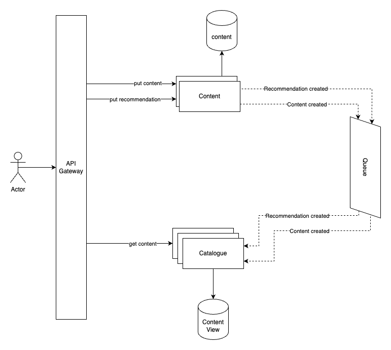

# 1. high-level content and recommendation design

Date: 2023-06-15

## Status

proposed

## Context

Our fictional scenario requires high availability and performance.  
We expect 80/100 of reads vs. updates,

## Decision

We are choosing a CQRS distributed approach in this context.  
We will count on a Content Management Service that will be responsive to manage the creation and update of the content and recommendations. This service will have a relational storage system.

The catalog will provide a calculated view of the content for the users. We will choose no-relational storage for this view.

## Consequences

We assume the complexity of adding read-update segregation to gain performance and separate scaling for both the catalog and content management system service independently.